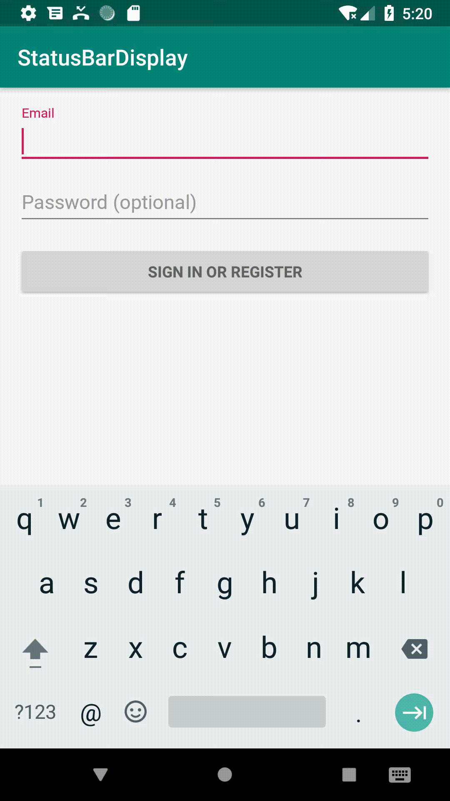

StatusBarToast
==============

Displaying text on your StatusBar!(Telegram-X like)


## Features
* Display Progress Bar
* Change Text Dynamically
* Toggle Progress Bar States





## Usage
* Unlimited Duration Toast:
```java
// create a toast and show it
StatusBarToast toast = new StatusBarToast.Builder(this)
        .setText("Connecting")
        .setShowProgressBar(true)
        .setDuration(StatusBarToast.DURATION_UNLIMITED)
        .setBackgroundColorResource(R.color.colorPrimaryDark)
        .build();
toast.show();

// somewhere else
toast.dismiss();
```

* Auto Hide Toast
```java
new StatusBarToast.Builder(this)
        .setText("Connecting")
        .setShowProgressBar(true)
        .setDuration(StatusBarToast.DURATION_LONG)
        .setBackgroundColorResource(R.color.colorPrimaryDark)
        .show();
```
